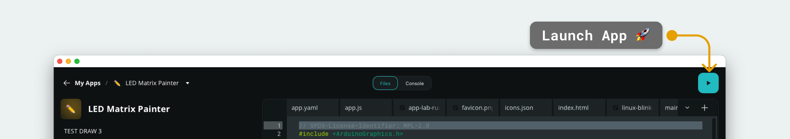
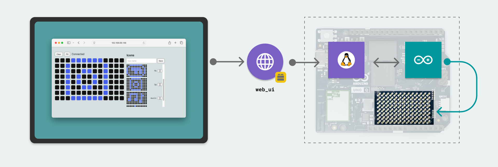

# LED Matrix Painter

With the **LED Matrix Painter** example, we can draw pixel art on the LED matrix on the UNO Q. The painter is accessible in a web interface, allowing you to draw and store pixel art (icons) and render them directly on the matrix.

## Bricks Used

- `web_ui` - used to host a web server on the board, serving HTML, CSS & JavaScript files.

## Hardware and Software Requirements

### Hardware

- Arduino® UNO Q
- USB-C® cable

### Software

- Arduino App Lab

## How to Use the Example

1. Connect the board to a computer using a USB-C® cable.
2. Launch the App by clicking on the "Play" button in the top right corner. Wait until the App has launched.
    

4. Open a browser and access `<board-name>.local:7000` (this may also launch automatically).
5. Draw some pixels on the LED matrix, using the web interface!

## How it Works

This example uses the `web_ui` Brick to host a web interface that is accessible over the local network (or in Single Board Computer (SBC) preview mode).

It takes the user input from the web interface (the pixel array), sends it to the `main.py` file via a websocket, and then via the **Bridge** tool, the pixel array is sent to the microcontroller.

In the web interface, we can draw icons, and save them (they will appear on the right side menu). Clicking on a saved icon will update the LED Matrix with the new icon.
- The icons are stored locally on the board in a `icons.json` file.



## Understanding the Code

The code for the LED Matrix Painter works as follows: 
- A web server is hosted with a web interface that can be accessed over local network (or on the board itself).
- A 13x8 grid of buttons makes it possible to activate each pixel individually. When clicking a pixel, the matrix updates directly.
- When a pixel is clicked, an array (containing the 13x8 pixels) is sent to the `main.py`.
- The updated frame is then sent to the microcontroller via Bridge.
- Additionally, a function on the Python side allows for storing icons locally, inside `icons.json`.

The pixel buffer, web handling and icon storage are handled inside the `matrix_app.py` module.

### main.py

Inside `main.py`, we use the following:
- `from matrix_app import MatrixCore, IconStore, wire_webui ` - we import a series of functions from `matrix_app.py`, which handles the connection between the `main.py` and the web interface.
- `core  = MatrixCore(W, H)` - we create the Matrix "core", which handles the frame updates.
- `icons = IconStore(W, H)` - we create an icon storage, which stores icons that can be rendered directly from the web interface.
- `def get_pixels_gs3()` - this function calls upon the core to fetch the latest frame received.
- `Bridge.provide("get_pixels_gs3", get_pixels_gs3)` - the pixel array is sent to the microcontroller using the Bridge tool.
- `wire_webui(ui, core, icons)` - handles all the incoming data from the web interface (e.g. icon storage, frames).
- `App.run()` - launches the App.

>For better understanding the Python application, view the `main.py` file, which includes detailed comments for each code segment.

### matrix_app.py

The `matrix_app.py` is a more advanced module, revolving around three key functionalities:
- `class MatrixCore` - this class manages the frame buffer. Incoming data from the web interface is stored using various methods in this class.
- `class IconStore` - this class has a series of methods that allows us to store, delete and fetch icons from the `icons.json` file.
- `def wire_webui(ui, core: MatrixCore, icons: IconStore)` - function that handles the communication between Python application and the web interface.

### Microcontroller (Sketch) Side

- First, we use `bool ok = Bridge.call("get_pixels_gs3", payload)` to fetch the latest pixel frame from `main.py`
- Then we use `parseCSV(payload, frame)` to get a frame suitable for the LED matrix library.
- Finally, we render the frame, using `matrix.draw(frame)`.

The key function on the sketch side is the `parseCSV` function, which parses the data received from `main.py`.
It converts the data to a format that is suitable for the `Arduino_LED_Matrix` library:

```arduino
static void parseCsv13x8_GS3(const String& csv, uint8_t out[104]) {
  // Parse up to 104 comma-separated ints (0..7). Missing entries => 0.
  int idx = 0;
  int start = 0;
  while (start < csv.length() && idx < 104) {
    int comma = csv.indexOf(',', start);
    if (comma < 0) comma = csv.length();
    String tok = csv.substring(start, comma);
    tok.trim();
    int v = tok.toInt();             // non-numeric => 0
    if (v < 0) v = 0; if (v > 7) v = 7;
    out[idx++] = (uint8_t)v;
    start = comma + 1;
  }
  while (idx < 104) out[idx++] = 0;
}
```